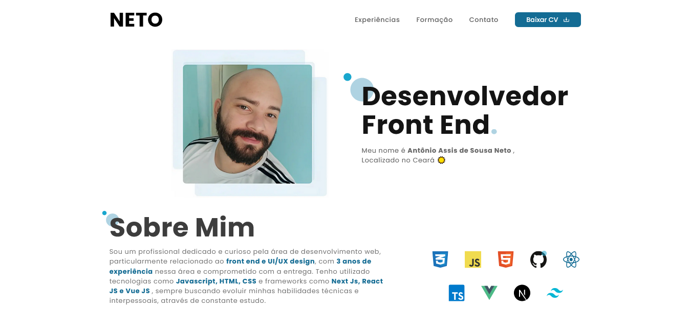

# Resume/Portfólio

> Projeto curriculo/portfólio feito a partir do curso da origamid - ui para iniciantes -  o projeto inicialmente foi prototipado no figma cujo o link é
> [Figma arquivo](https://www.figma.com/proto/UqNCK3c4DA3G28YGFULed4/Portif%C3%B3lio?page-id=9%3A357&type=design&node-id=165-2&viewport=55%2C347%2C0.37&t=IuEh1ynTfMAqfL4R-1&scaling=min-zoom&mode=design)

## 💻 Pré-requisitos

Antes de começar, verifique se você atendeu aos seguintes requisitos:

* Ter instalado a versão mais recente do Node js;

## ☕ Onde acessar

Você pode acessar o portfolio através desse link:

## 🤝 Colaboradores

Agradecemos às seguintes pessoas que contribuíram para este projeto:

<table>
  <tr>
    <td align="center">
      <a href="#">
         
        
          <b>Neto Sousa</b>
        
      </a>
    </td>
  </tr>
</table>

## 🛠️ Tecnologias

* [Next Js](https://nextjs.org/)
* [React Js](https://react.dev/)
* [Typescript](https://www.typescriptlang.org/)
* [Tailwind](https://tailwindcss.com/)
* [React-icons](https://react-icons.github.io/react-icons/)

## 📝 Licença

Esse projeto está sob licença. Veja o arquivo [LICENÇA](LICENSE.md) para mais detalhes.
